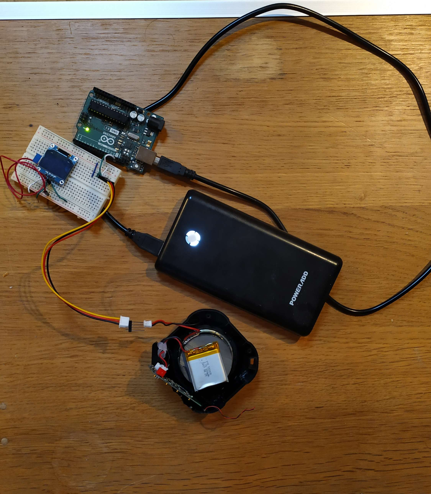

# Collection of Arduino Projects: 
# Most Recent Play Toto

## Overview
This Arduino project allows you to play the iconic song "Africa" by Toto using an Arduino board and a piezo buzzer. By following the instructions below, you can recreate the melody of "Africa" on your Arduino setup.
Due to the memory limitations of the Arduino, you can only play about 3.5 seconds of the song.

https://github.com/stiangglanda/MyArduinoPlayground/assets/69088823/20a28e53-e0dc-461f-b103-f45bd436a0a2

## Requirements
- Arduino board (e.g., Arduino Uno)
- Piezo buzzer or speaker
- Jumper wires
- Arduino IDE installed on your computer
- The PCM library
- Basic knowledge of Arduino programming

## Installation
1. Connect the positive (red) wire of the piezo buzzer to digital pin 11 on the Arduino board.
2. Connect the negative (black) wire of the piezo buzzer to the ground (GND) pin on the Arduino board.
3. Download the `PlayToto.ino` sketch from this repository.
4. Open the `PlayToto.ino` sketch in the Arduino IDE.
5. Verify and upload the sketch to your Arduino board.

## Usage
Once the sketch is uploaded to your Arduino board, the Arduino will play the melody of "Africa" by Toto through the connected piezo buzzer. You can adjust the tempo or experiment with different melodies by modifying the notes and durations in the sketch.
